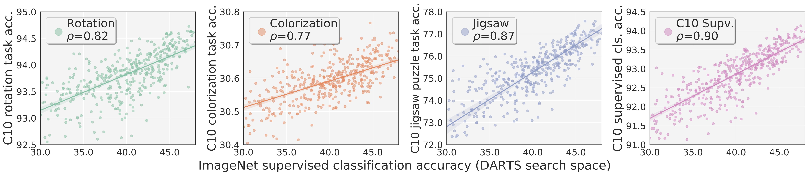
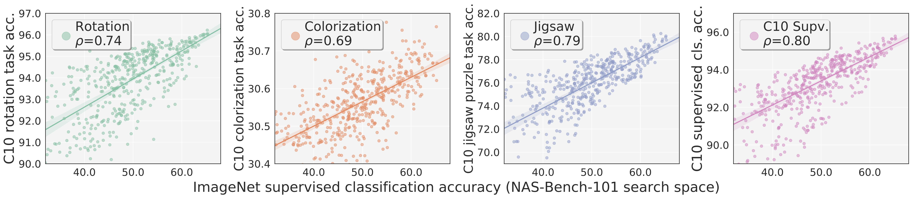

# unnas

This is the code and data release for the [Are Labels Necessary for Neural Architecture Search?](https://arxiv.org/abs/2003.12056) project. It is a superset of the [pycls](https://github.com/facebookresearch/pycls) codebase written in [PyTorch](https://pytorch.org/), by supporting more:

- Tasks: Rotation Prediction (`rot`), Colorization (`col`), Solving Jigsaw Puzzles (`jig`), Semantic Segmentation (`seg`)
- Datasets: ImageNet-22K (`imagenet22k`), Cityscapes (`cityscapes`)
- Backbones: NAS-like (`nas`), NAS-Bench-101 (`nas_bench`)
- Modes: Differentiable Architecture Search (`nas_search`)

<div align="center">
  
  
  <p align="center"><b>unnas</b> supports a wide range of tasks, datasets, backbones, and modes for neural architecture related research.</p>
</div>

## Using unnas

In addition to installing PyTorch with CUDA support, run:

```
cd /path/to/clone/unnas
git clone https://github.com/facebookresearch/unnas
cd unnas
pip install -r requirements.txt
export PYTHONPATH=.
```

Then please follow [`DATA.md`](docs/DATA.md) to set up the datasets.

All experiments were conducted using (up to 8) Nvidia Quadro GV100, each with 32GB memory. If you are using GPUs with smaller memory, the provided configs may result in out-of-memory error. 

## Sample-Based Experiments

To train an architecture used in sample-based experiments:

```
python tools/train_net.py \
    --cfg configs/sample_based/SPACE/DATASET/TASK/ID.yaml \
    OUT_DIR tmp
```

where:

- `SPACE` is either `darts` or `nas_bench`
- `DATASET` is either `cifar10` or `imagenet`
- `TASK` is either `cls` or `rot` or `col` or `jig`
- `ID` could be `00004` for `darts`, or `000907` for `nas_bench`

To use different random seeds (e.g. `2`), simply append `RNG_SEED 2` to the command. To obtain our results of these runs:

```
wget https://dl.fbaipublicfiles.com/unnas/unnas_summaries.zip
unzip unnas_summaries.zip
rm unnas_summaries.zip
```

Repeating our analysis is essentially equivalent to generating the figures in the paper. To do so:

```
python figs/fig234.py
python figs/fig5.py
```

The generated figures will be under the `figs/` folder. 

## Search-Based Experiments

To repeat the *search phase*:

```
python tools/train_net.py \
    --cfg configs/search_based/search_phase/DATASET/TASK.yaml \
    OUT_DIR tmp
```

where:

- `DATASET` is either `imagenet` or `imagenet22k` or `cityscapes`
- `TASK` is either `cls`/`seg` or `rot` or `col` or `jig`

To repeat the *evaluation phase*:

```
python tools/train_net.py \
    --cfg configs/search_based/eval_phase/TASK/ARCH.yaml \
    OUT_DIR tmp
```

where:

- `TASK` is either `cls` (ImageNet-1K classification) or `seg` (Cityscapes semantic segmentation)
- `ARCH` could be `darts`, `imagenet_rot`, `imagenet22k_col`, `cityscapes_jig`, etc

For either phase, to use different random seeds (e.g. `2`), simply append `RNG_SEED 2` to the command.

## Citing unnas

If you find **unnas** helpful in your research, please consider citing:

```
@InProceedings{Liu2020,
  title = {Are Labels Necessary for Neural Architecture Search?},
  author = {Liu, Chenxi and Doll{\'a}r, Piotr and He, Kaiming and Girshick, Ross and Yuille, Alan and Xie, Saining},
  booktitle = {ECCV},
  year = {2020}
}
```

## License

**unnas** is released under the MIT license. Please see the [LICENSE](LICENSE) file for more information.
